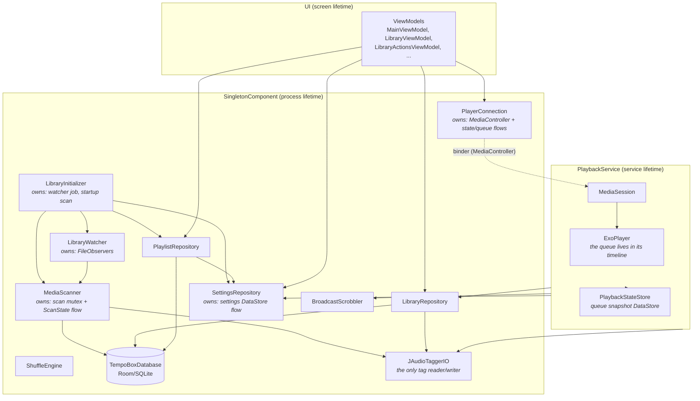

# Deep dive 1: App startup & the DI graph

> Prerequisites: [Android primer](../android-primer.md) §1 (components), §6
> (ViewModel/StateFlow), §8 (Hilt).

This walkthrough answers: what actually happens when the TempoBox process
starts, which singletons exist, who constructs them, and who owns which
long-running work.

## 1. Process start: `TempoBoxApplication`

Android instantiates the `Application` subclass named in the manifest before
any activity or service —
[`app/src/main/kotlin/com/tempobox/TempoBoxApplication.kt`](../../app/src/main/kotlin/com/tempobox/TempoBoxApplication.kt):

```kotlin
@HiltAndroidApp
class TempoBoxApplication : Application(), ImageLoaderFactory {

    @Inject lateinit var libraryInitializer: LibraryInitializer
    @Inject lateinit var trackArtworkFetcherFactory: TrackArtworkFetcher.Factory
    @Inject @ApplicationScope lateinit var appScope: CoroutineScope

    override fun onCreate() {
        super.onCreate()
        libraryInitializer.onAppStart()
    }
    ...
}
```

Three things happen here, and only three — the class is deliberately thin:

1. **`@HiltAndroidApp` bootstraps the DI container.** At build time Hilt has
   generated the whole object graph; at runtime this annotation makes
   `super.onCreate()` create the `SingletonComponent` (the process-wide
   scope) and field-inject the three `@Inject lateinit var`s. Everything else
   in the app resolves from this container.

2. **`libraryInitializer.onAppStart()` kicks off the library lifecycle** —
   startup rescan, folder watching, smart-playlist export refresh (detailed
   in [deep dive 2](02-library-scanning-and-database.md) and
   [deep dive 6](06-playlists.md)). Note what does *not* happen: no blocking
   work. `onAppStart()` only launches coroutines on the injected application
   scope; `Application.onCreate` runs on the main thread and anything slow
   here delays the first frame of every launch.

3. **`newImageLoader()` registers the custom Coil pipeline.** Coil (the image
   loading library, ≈ an `` loader with memory/disk caches) asks the
   application for its `ImageLoader` because the class implements
   `ImageLoaderFactory`. TempoBox installs
   [`TrackArtworkFetcher`](../../core/artwork/src/main/kotlin/com/tempobox/artwork/TrackArtwork.kt),
   which teaches Coil to resolve the model `TrackArtwork(path)` by extracting
   the embedded artwork bytes from the audio file's tag, and
   `TrackArtworkKeyer`, which keys the cache on `path + file mtime` so
   re-tagged artwork is never served stale. After this, any composable can
   write `AsyncImage(model = TrackArtwork(track.filePath), …)` and album art
   appears — no manual byte plumbing in the UI.

### What starts lazily

Nothing else is eagerly created. `PlaybackService` starts the first time a
`MediaController` connects (first `PlayerConnection` use) or the OS delivers a
media button. ViewModels are created when their screen first composes. This
is the normal Android posture: the OS may start your process for a 50 ms
broadcast; the less `onCreate` does, the better.

## 2. The module map: who provides what

Hilt modules are provider-registration points. All of TempoBox's install into
`SingletonComponent` (process-wide, one instance per binding):

| Module | File | Provides |
|---|---|---|
| `CoroutinesModule` | [`app/.../di/CoroutinesModule.kt`](../../app/src/main/kotlin/com/tempobox/di/CoroutinesModule.kt) | `@IoDispatcher` / `@DefaultDispatcher` / `@MainDispatcher` (qualifier-tagged `CoroutineDispatcher`s) and the `@ApplicationScope` `CoroutineScope` |
| `DatabaseModule` | [`core/database/.../di/DatabaseModule.kt`](../../core/database/src/main/kotlin/com/tempobox/database/di/DatabaseModule.kt) | the Room `TempoBoxDatabase` (singleton) + `TrackDao` / `PlaylistDao` |
| `SettingsModule` | [`core/settings/.../di/SettingsModule.kt`](../../core/settings/src/main/kotlin/com/tempobox/settings/di/SettingsModule.kt) | the settings `DataStore<Preferences>` and the `SettingsRepository` interface binding |
| `TagsModule` | [`core/tags/.../di/TagsModule.kt`](../../core/tags/src/main/kotlin/com/tempobox/tags/di/TagsModule.kt) | binds `TagReader` and `TagWriter` to the single `JAudioTaggerIO` |
| `ScrobbleModule` | [`core/scrobble/.../di/ScrobbleModule.kt`](../../core/scrobble/src/main/kotlin/com/tempobox/scrobble/di/ScrobbleModule.kt) | binds `Scrobbler` → `BroadcastScrobbler` |
| `ArtworkModule` | [`core/artwork/.../di/ArtworkModule.kt`](../../core/artwork/src/main/kotlin/com/tempobox/artwork/di/ArtworkModule.kt) | the app-wide `OkHttpClient` (used only by the Discogs artist-image fetcher) |

Everything else — repositories, the scanner, `PlayerConnection`, the shuffle
engine — needs no module at all: they are concrete `@Singleton class Foo
@Inject constructor(…)` classes, which Hilt can construct directly. Modules
only exist where there's an interface to bind, a third-party type to
configure, or a qualifier to disambiguate.

### Why dispatcher qualifiers instead of calling `Dispatchers.IO` directly

`CoroutinesModule` exists so classes declare *which* dispatcher they need as a
constructor dependency (`@IoDispatcher private val ioDispatcher`). Production
injects the real dispatcher; tests construct the class with a
`TestDispatcher` by hand — no DI involved, no global mocking of
`Dispatchers`. The same reasoning applies to `@ApplicationScope`: it's a
`SupervisorJob`-rooted scope for fire-and-forget process-lifetime work
(scans, playlist exports), supervisor so one failed child doesn't cancel its
siblings.

### Two patterns worth pausing on

**The DataStore delegate, not a plain `@Provides`.** From
[`SettingsModule`](../../core/settings/src/main/kotlin/com/tempobox/settings/di/SettingsModule.kt):

```kotlin
// Process-wide DataStore instance. A property delegate (not a Hilt @Singleton
// factory) because @Singleton is only unique per Hilt component — instrumented
// tests build a fresh component per test method, and a second DataStore on the
// same file crashes ("multiple DataStores active").
private val Context.settingsDataStore: DataStore<Preferences> by preferencesDataStore(
    name = "tempobox_settings",
)
```

DataStore enforces one live instance per backing file per *process*. Hilt's
`@Singleton` guarantees one instance per *component* — and the instrumented
test harness creates a fresh component per test method in the same process.
The Kotlin property delegate is a true process-level singleton, so the
`@Provides` function just returns it. This is an embedded lesson: "singleton"
has a scope, and the scope that matters here is the process, not the
container.

**Entry points for OS-constructed classes Hilt can't touch.** Glance widget
`ActionCallback`s are instantiated reflectively by the framework with no
injection hook, so
[`TempoBoxWidget`](../../app/src/main/kotlin/com/tempobox/widget/TempoBoxWidget.kt)
declares:

```kotlin
@EntryPoint
@InstallIn(SingletonComponent::class)
interface WidgetEntryPoint {
    fun playerConnection(): PlayerConnection
    fun tagReader(): TagReader
}
```

and looks the graph up via `EntryPointAccessors.fromApplication(...)` —
service-locator style, used only where constructor/field injection is
impossible.

## 3. The ownership graph

Who holds the long-lived state, and through what:



Reading it as a backend system: `SingletonComponent` is the application
container; `PlaybackService` is a separately-supervised daemon that happens to
share the process and the container (it's `@AndroidEntryPoint`, so its
`@Inject` fields come from the same graph); ViewModels are request-scoped
facades. Three ownership rules fall out:

1. **The database is the source of truth for library data**; repositories are
   the only things that touch DAOs (UI never does — CLAUDE.md rule 2).
2. **The ExoPlayer timeline is the source of truth for the queue**, and it
   lives inside the service. `PlayerConnection` is a singleton *mirror* of it
   on the UI side — it holds no authoritative state beyond the shuffle mode
   and the remembered pre-shuffle order ([deep dive 4](04-queue.md)).
3. **Cross-cutting IO has exactly one implementation each**: one tag IO class,
   one scrobbler, one OkHttp client.

## 4. From graph to pixels: how a screen gets its dependencies

The chain for, say, the Library screen:

1. `MainActivity` (annotated `@AndroidEntryPoint`) calls
   `setContent { AppRoot() }` —
   [`MainActivity.kt`](../../app/src/main/kotlin/com/tempobox/MainActivity.kt).
2. [`AppRoot`](../../app/src/main/kotlin/com/tempobox/ui/AppRoot.kt) calls
   `hiltViewModel()` to get
   [`MainViewModel`](../../app/src/main/kotlin/com/tempobox/ui/MainViewModel.kt),
   whose constructor demands `SettingsRepository` and `PlayerConnection` —
   both resolved from the singleton graph. The ViewModel itself is cached in
   the navigation back-stack entry's store (per-route singleton).
3. Composables collect `viewModel.settings` / `viewModel.nowPlaying`
   StateFlows via `collectAsState()`; recomposition takes it from there.

ViewModels are the boundary: above them, pure Compose; below them, the
singleton graph. No composable ever constructs a repository, and no
repository knows the UI exists.

## 5. Service startup, for completeness

`PlaybackService.onCreate`
([`PlaybackService.kt`](../../core/playback/src/main/kotlin/com/tempobox/playback/PlaybackService.kt))
builds the ExoPlayer and MediaSession, restores the persisted queue, and
registers its Bluetooth/volume receivers — the full tour is
[deep dive 3](03-playback.md). The point for *this* document: the service is
`@AndroidEntryPoint`, so its `settingsRepository`, `libraryRepository`,
`scrobbler`, `stateStore`, and `tagReader` fields are injected from the same
`SingletonComponent` the UI uses. One graph, two lifecycles.
