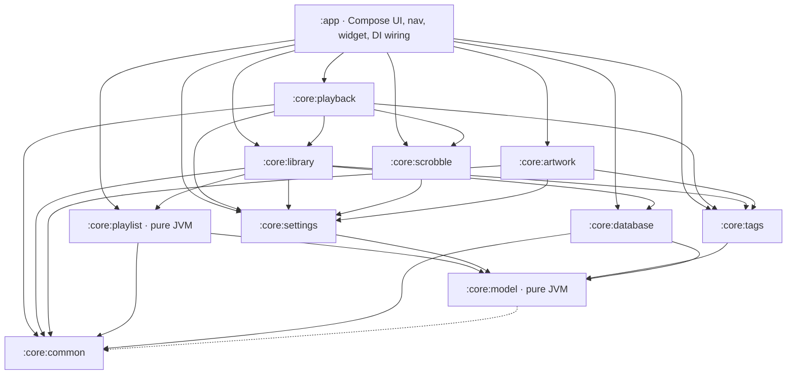

# Deep dive 10: Build, CI & release

> Prerequisites: [Android primer](../android-primer.md) §12 (Gradle/AGP,
> modules, debug vs release).

## 1. The module graph

Declared in [`settings.gradle.kts`](../../settings.gradle.kts) (which also
carries an ASCII graph in its header comment): one application module and ten
libraries, dependencies pointing strictly downward.

Why it's cut this way (see also [ARCHITECTURE.md](../ARCHITECTURE.md)):

- **`core:model` and `core:playlist` are plain `kotlin.jvm` modules**, with no
  AGP and no Android runtime, so the most intricate logic (rule matching,
  sorting, the M3U codec, tag-edit derivation) runs as millisecond JUnit.
  Their build files carry one quirk: an explicit `jvmTarget = 17`, because
  Android Studio's bundled JDK is 21 and without the pin Kotlin would target
  21 while javac targets 17, failing Gradle's consistency check.
- Horizontal layers (`settings`, `tags`, `database`) sit below the two big
  feature modules (`library`, `playback`), which can therefore never reach
  into each other's internals except through those shared layers.
- `enableFeaturePreview("TYPESAFE_PROJECT_ACCESSORS")` gives the typed
  `projects.core.model` syntax in dependency blocks: typo-proof module refs.

## 2. Convention plugins (`build-logic/`)

The repo uses Gradle's **included build** pattern:
`pluginManagement { includeBuild("build-logic") }` compiles a tiny plugin
project before the main build, exposing four plugins
([`build-logic/convention/build.gradle.kts`](../../build-logic/convention/build.gradle.kts)):

| Plugin id | Class | What applying it means |
|---|---|---|
| `tempobox.android.application` | [`AndroidApplicationConventionPlugin`](../../build-logic/convention/src/main/kotlin/AndroidApplicationConventionPlugin.kt) | com.android.application + shared config + `targetSdk` |
| `tempobox.android.library` | [`AndroidLibraryConventionPlugin`](../../build-logic/convention/src/main/kotlin/AndroidLibraryConventionPlugin.kt) | com.android.library + shared config (no targetSdk, which is deprecated for libraries; the app decides) |
| `tempobox.android.compose` | [`AndroidComposeConventionPlugin`](../../build-logic/convention/src/main/kotlin/AndroidComposeConventionPlugin.kt) | Compose compiler plugin + BOM + the standard Compose deps |
| `tempobox.hilt` | [`HiltConventionPlugin`](../../build-logic/convention/src/main/kotlin/HiltConventionPlugin.kt) | KSP + Hilt plugin + hilt-android/compiler deps |

The shared config lives in
[`BuildLogic.kt`](../../build-logic/convention/src/main/kotlin/BuildLogic.kt):
SDK levels read from the version catalog, Java/Kotlin 17 targets, unit-test
options (`isIncludeAndroidResources` for Robolectric,
`isReturnDefaultValues`), packaging excludes for jaudiotagger's duplicate
license files, and coroutine opt-ins. The effect: a core module's entire
build file is ~10 lines of "what am I";
see [`core/playback/build.gradle.kts`](../../core/playback/build.gradle.kts).

Embedded lessons (all commented in the source; this repo rode the AGP 9
migration early, and the comments are the trail):

- **AGP 9's built-in Kotlin**: no `org.jetbrains.kotlin.android` plugin
  anywhere; AGP registers the `kotlin` extension itself, and the convention
  code configures `KotlinAndroidExtension` accordingly. The catalog comment
  notes `kotlin-android` was removed.
- **Gradle 9 fails test tasks that discover zero tests.** Android unit-test
  tasks always have inputs (Robolectric resources), so a module without tests
  yet would fail the build, hence `failOnNoDiscoveredTests = false`.
- **build-logic compiles against AGP/Kotlin plugin APIs only** (`compileOnly`);
  KSP/Compose plugins are applied by id, never imported, because KSP ≥ 2.3 is
  compiled with Kotlin metadata newer than Gradle's embedded Kotlin can read.
- AGP 9 API churn handled in comments: `CommonExtension` property-style
  config, and the new `androidComponents.onVariants` Variant API replacing
  `applicationVariants` (used in `:app` to rename the debug APK to
  `TempoBox-debug.apk`; debug only, because the release workflow expects
  AGP's default output names).

## 3. The version catalog

[`gradle/libs.versions.toml`](../../gradle/libs.versions.toml) is the single
source of truth for every version: dependency, plugin, *and SDK levels*
(`compileSdk = 37`, `targetSdk = 35`, `minSdk = 26` are catalog versions the
convention plugins read via `versionInt`). Hard rule 1 in CLAUDE.md: no
version strings in build files.

The catalog doubles as a compatibility ledger: its comments record *why*
floors exist, which is gold when bumping:

- `agp = 9.3.1` needs Gradle ≥ 9.5.0; KSP `2.3.x` is versioned independently
  of Kotlin now, with ≥ 2.3.1 required for AGP 9's built-in Kotlin;
- Room ≥ 2.8 because 2.6 predates KSP2 ("unexpected jvm signature V");
  `room-ktx` is gone (merged into runtime in 2.7);
- Hilt ≥ 2.60 because < 2.59 fails under AGP 9 ("Android BaseExtension not
  found");
- `compileSdk = 37` is forced by core-ktx 1.19 / Compose 1.12 / navigation
  2.10; `minSdk = 26` is jaudiotagger's `java.nio` floor;
- Robolectric 4.14 supports at most SDK 35 → the per-module
  `robolectric.properties` pin (`sdk=35`), since Robolectric otherwise
  inherits compileSdk ([deep dive 7 §5](07-settings.md)).

## 4. App module specifics

[`app/build.gradle.kts`](../../app/build.gradle.kts):

- `debug` adds `applicationIdSuffix = ".debug"` → side-by-side install with
  the release app.
- `release` enables R8 (`isMinifyEnabled` + `isShrinkResources`) with the
  default optimize rules + [`proguard-rules.pro`](../../app/proguard-rules.pro).
- Lint runs with `abortOnError = false`; CI archives the report, but
  findings don't redden the pipeline until a baseline is curated (comment in
  the file).
- `testInstrumentationRunner = "com.tempobox.HiltTestRunner"`: the custom
  runner that swaps in Hilt's test application for instrumented tests.

## 5. CI ([`.github/workflows/ci.yml`](../../.github/workflows/ci.yml))

Runs on every push to `main`, every PR, and manual dispatch, with
per-ref concurrency cancellation. Three jobs:

| Job | What | When |
|---|---|---|
| `unit-tests` | `./gradlew test testDebugUnitTest`: all JVM tests in every module (pure JUnit + Robolectric) | always |
| `build` | `:app:lintDebug` + `:app:assembleDebug`; debug APK uploaded as a 30-day artifact | always |
| `instrumented` | `:app:connectedDebugAndroidTest` on an API 34 pixel_6 emulator (reactivecircus/android-emulator-runner, KVM enabled via a udev rule) | pushes to `main` + manual only |

The instrumented job is excluded from PRs deliberately: emulator boots cost
~15 minutes, and the unit suite carries most of the behavioral coverage
(that's a design goal of the module split). Test/lint reports upload only on
failure. All jobs share the Gradle build cache via
`gradle/actions/setup-gradle`.

Dependabot files weekly grouped update PRs for both Gradle deps (one TOML to
touch; the catalog paying off) and GitHub Actions.

## 6. Release ([`.github/workflows/release.yml`](../../.github/workflows/release.yml))

Full walkthrough in [RELEASING.md](../RELEASING.md); mechanics here. Trigger:
push a `v*` tag (or manual dispatch naming an existing tag, useful for
re-publishing after adding signing secrets). One job:

1. **Gate**: the whole unit suite runs again.
2. `./gradlew :app:assembleRelease` → `app-release-unsigned.apk` (the build
   itself has no signing config; signing is CI's job).
3. **Signing is conditional on repository secrets.** If `KEYSTORE_B64`
   exists, the step decodes it to a temp keystore and signs with the newest
   SDK build-tools' **`apksigner`** (passwords via `KEYSTORE_PASSWORD` /
   `KEY_ALIAS` / `KEY_PASSWORD`, fed as env vars, never echoed), verifies the
   signature, and deletes the keystore. Without secrets it publishes the
   unsigned APK under an explicit `-unsigned` name instead of failing, so CI
   validation works on forks with zero setup.
4. A `gh` CLI step publishes the GitHub Release: it uploads whichever APK
   exists to the release if one already exists for the tag (common for
   manual dispatch), otherwise creates the release with auto-generated
   notes. The repo's Actions policy blocks third-party release actions,
   which is why this is plain `gh` instead of an action.

Why sign in CI with secrets at all: Android app identity is
*applicationId + signing certificate*. Updates install only if signed with
the same key, so the key must be long-lived, secret, and never in the repo.
Base64-ing the keystore into a GitHub Actions secret is the standard
sideload-distribution pattern. (Losing the keystore means users must
uninstall to update; RELEASING.md shouts about backups.)

Versioning is manual: bump `versionCode`/`versionName` in
`app/build.gradle.kts`, merge, tag `vX.Y.Z`, push the tag.

## 7. Local workflows

The README covers these, briefly: shared IDE run configurations under
[`.run/`](../../.run) (app, unit tests, instrumented tests), VS Code tasks +
launch config under [`.vscode/`](../../.vscode), and the CLI equivalents
(`./gradlew assembleDebug`, `installDebug`, `testDebugUnitTest test`,
`:app:connectedDebugAndroidTest`). A fresh clone needs only an SDK path
(`local.properties` / `ANDROID_HOME`) and network for the first dependency
resolution.
